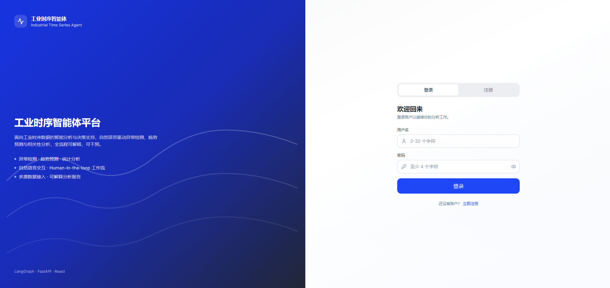
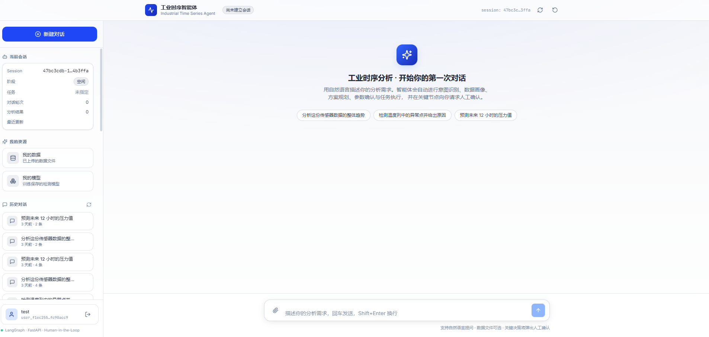
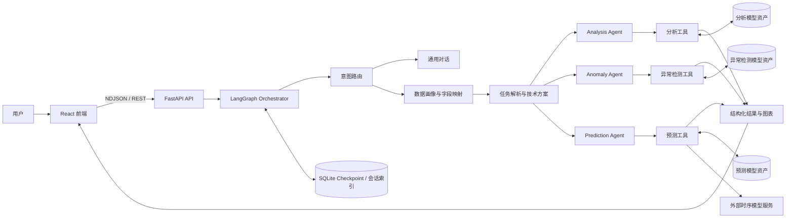
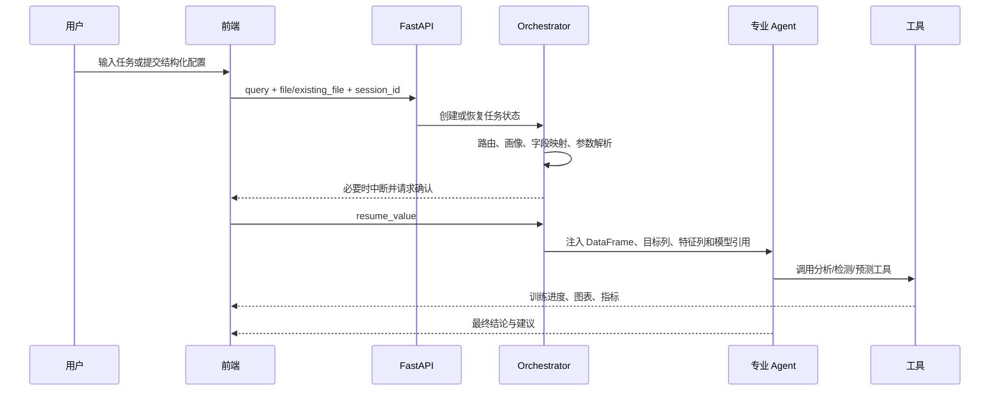

<div align="center">

# Industrial Time Series Agent

### 工业时间序列多智能体分析平台

面向工业数据的对话式分析、异常检测、时序预测与根因诊断系统


</div>

## 项目简介

Industrial Time Series Agent 是一个面向工业时序数据的多智能体应用。用户可以上传或复用 CSV 数据，通过自然语言对话或结构化业务入口发起任务，系统自动完成数据画像、字段映射、任务路由、方案确认、工具执行、结果解释与可视化。

当前系统覆盖三类核心任务：

- 数据分析：统计分析、趋势、分布、相关性、变点、SPC、过程能力，以及基于 CatBoost 和 TreeSHAP 的根因分析。
- 异常检测：支持自动推荐、模型训练与持久化、加载已有模型检测、阈值处理、评估对比和异常解释。
- 时序预测：调用外部时序基础模型服务完成单模型预测、多模型比较、集成预测、回测与微调。

系统同时提供“我的数据”“我的模型”“我的智能体”等资产入口。通用 Agent 编排层和业务智能体共用同一套后端能力，业务智能体只负责把用户配置编译成结构化任务，不复制核心分析流程。

## 产品界面

### 登录与注册

<p align="center">
  
</p>

### 对话与资产管理

<p align="center">
  
</p>

## 主要能力

| 模块 | 能力 |
| --- | --- |
| 多智能体编排 | LangGraph 状态图、意图路由、数据画像、参数解析、技术方案、专业任务 Agent、通用对话 |
| Human-in-the-Loop | 文件上传、历史数据复用、字段澄清、技术路径选择、模型选择与任务恢复 |
| 数据分析 | 数据质量、描述统计、分布、趋势、相关性、互信息、自相关、季节性、分解、平稳性、变点、SPC、过程能力、组间比较 |
| 根因分析 | 使用 `feature_columns` 预测各 `target_columns`，分别训练 CatBoost 模型，输出评估指标、特征重要性和 TreeSHAP |
| 异常检测 | PyOD 体系、原生时序检测器、滑窗桥接、训练/加载、集成、阈值、评估和解释 |
| 时序预测 | 单模型、多模型、集成预测、概率区间、回测、模型微调与模型资产复用 |
| 模型资产 | 数据分析、异常检测、时序预测三类模型统一展示，并支持在上传数据时选择已训练模型 |
| 可视化 | 预测曲线、回测、异常点/区间、训练进度、控制图、相关性热力图、直方图、时序分解、ACF/PACF、变点、FeatureImportance 和 TreeSHAP |
| 多租户隔离 | 用户数据、会话、模型文件按用户命名空间隔离；模型路径由后端 runtime 安全解析 |
| 流式交互 | `/api/query` 使用 NDJSON 推送状态、文本、工具结果、图表和中断事件 |

## 业务智能体

“我的智能体”采用领域二级目录，目前包含以下结构化任务入口：

| 领域 | 智能体 | 核心能力 |
| --- | --- | --- |
| 设备域 | 锂电涂布面密度分析智能体 | SPC、稳定性、过程能力、趋势、分布、变点、相关性和综合诊断 |
| 设备域 | 锂电涂布面密度异常检测智能体 | 面密度异常点、连续异常区间及异常分区检测 |
| 设备域 | 锂电分容容量偏低根因分析智能体 | 基于分容容量和工艺参数训练树模型，输出特征重要性与 TreeSHAP |
| 市场域 | 动力电池装车量预测智能体 | 按电池类型和外生变量预测未来装车量 |
| 市场域 | 新能源汽车销量预测智能体 | 按 BEV、PHEV、EREV、乘用车、商用车等维度预测销量 |
| 生产域 | 暂无 | 预留生产过程优化类应用 |

业务智能体注册位于 `agent_app/applications/registry.py`，前端页面位于 `frontend/src/features/agent-apps/`。

## 系统架构



### 一次工业任务的典型流程



## 工具与模型

### 数据分析

分析工具位于 `agent_app/tools/analysis_tools/`，采用统一的 `AnalysisContext`：

```text
ctx.df
ctx.target_columns
ctx.feature_columns
```

主要工具族包括：

- 数据质量：缺失值、重复值、常量/低方差列。
- 分布与趋势：描述统计、分布形态、直方图、线性趋势、Mann-Kendall、滚动趋势。
- 关系分析：Pearson/Spearman/Kendall 相关性、交叉相关、互信息。
- 时序结构：ACF/PACF、季节性、STL/经典分解、平稳性。
- 变点与稳定性：均值变点、方差变点、CUSUM、稳定性、控制图、过程能力。
- 组间比较：分组统计、分布比较和两组检验。
- 根因分析：`analyze_root_causes_catboost`。

根因模型按用户、会话和数据集持久化：

```text
agent_app/artifacts/analysis_models/<user>/<thread>/<dataset>_analysis/<save_name>.joblib
```

加载已有模型时不会重新训练；系统使用新数据预测并重新计算当前数据的 TreeSHAP。模型全局 FeatureImportance 来源于已训练树结构。

### 异常检测

异常检测工具位于 `agent_app/tools/anomaly_detection_tools/`，包含知识查询、模型推荐、训练与检测、模型加载、评估、集成、阈值和解释能力。

结构化涂布异常检测入口支持 SpectralResidual、MatrixProfile、SAND、TimeSeriesOD + ECOD、TimeSeriesOD + IForest、LSTMAD 和 AnomalyTransformer。底层还包含 PyOD 检测器及 KShape、TimeSeriesOD 等时序能力。

异常模型保存在：

```text
agent_app/artifacts/anomaly_detection/<user>/<thread>/<dataset>_anomaly_detection/
```

### 时序预测

预测工具位于 `agent_app/tools/prediction_tools/`。当前统一接入七个时序基础模型：

- `sundial`
- `toto-2`
- `timer-s1`
- `chronos-2`
- `timesfm-2.5`
- `moirai-2.0-R-small`
- `tirex-1.1-gifteval`

不同模型的原始输出会归一化为统一的点预测、分位数/样本和形状描述。预测工具依赖可访问的外部时序模型 HTTP 服务；服务地址和模型路由目前配置在 `agent_app/tools/prediction_tools/_common.py`。微调服务相关配置见 `agent_app/tools/prediction_tools/finetuning_tools.py`。

## 技术栈

### 后端

- Python 3.12（Docker 镜像）
- FastAPI、Uvicorn
- LangChain、LangGraph、SQLite Checkpoint
- Pydantic v2
- pandas、NumPy、SciPy、scikit-learn、statsmodels
- CatBoost、joblib
- PyOD 扩展与 PyTorch 时序异常检测模型
- Matplotlib、Plotly

### 前端

- React 18、TypeScript 5.5
- Vite 5、Tailwind CSS 3
- Recharts
- React Markdown、highlight.js
- Lucide React

## 项目结构

```text
Industrial_Time_Series_Agent/
├── agent_app/
│   ├── agents/                  # Agent 与 LangGraph 编排
│   ├── applications/            # 结构化业务智能体后端适配器
│   ├── artifacts/               # 分析、异常检测、预测模型资产
│   ├── auth/                    # 用户注册、登录与用户存储
│   ├── charts/                  # 后端图表事件构建器
│   ├── config/                  # LLM、数据库和运行配置
│   ├── models/                  # Pydantic 状态与接口模型
│   ├── prompts/                 # 各 Agent 系统提示词
│   ├── skills/                  # 分析、异常检测、预测技能说明
│   ├── state/                   # 会话状态与对话记忆
│   ├── tools/                   # 分析、异常检测、预测和画像工具
│   ├── api.py                   # FastAPI 入口
│   └── main.py                  # 系统门面类
├── frontend/
│   ├── src/components/          # 对话、图表、中断、资产与布局组件
│   ├── src/context/             # 会话与认证状态
│   ├── src/features/agent-apps/ # 结构化业务智能体页面
│   ├── src/services/            # API 客户端
│   └── src/types/               # 前端事件与数据类型
├── uploads/                     # 按用户隔离的上传数据
├── docker/nginx.conf            # 生产前端反向代理配置
├── Dockerfile                   # 多阶段镜像
├── docker-compose.yml           # 本地容器化开发编排
├── requirements.txt             # Docker 后端依赖源
└── README.md
```

## 快速开始

### 方案一：Docker Compose

前置要求：Docker Engine 与 Docker Compose v2。

1. 创建 `agent_app/.env`：

```dotenv
MODEL_NAME=your-model-name
BASE_URL=http://your-openai-compatible-service/v1
API_KEY=your-api-key
TEMPERATURE=0.7
TIMEOUT=600

DB_BACKEND=sqlite
DB_CONNECTION_STRING=sqlite:///sessions.db
DB_TABLE_NAME=sessions

MAX_CONVERSATION_HISTORY=50
SESSION_TIMEOUT_MINUTES=30
DEFAULT_PREDICTION_STEPS=25
MAX_PREDICTION_STEPS=100
MAX_FILE_SIZE_MB=100
```

2. 构建并启动：

```bash
docker compose up -d --build
```

3. 查看状态和日志：

```bash
docker compose ps
docker compose logs -f backend
docker compose logs -f frontend
```

4. 访问服务：

- 前端：`http://localhost:5173`
- 后端健康检查：`http://localhost:8000/health`
- Swagger：`http://localhost:8000/docs`

只重建后端容器：

```bash
docker compose up -d --force-recreate backend
```

该命令选择 Compose 中名为 `backend` 的服务，并不会在命令行里直接指定镜像。

### 使用指定后端镜像

部署已有镜像时，可以在 `docker-compose.yml` 中为后端设置 `image`，并移除或注释 `build`：

```yaml
services:
  backend:
    image: registry.example.com/industrial-ts-agent-backend:1.0.0
    restart: unless-stopped
    env_file:
      - path: ./agent_app/.env
        required: false
    volumes:
      - ./uploads:/app/uploads
      - ./agent_app/artifacts:/app/agent_app/artifacts
    ports:
      - "8000:8000"
```

然后执行：

```bash
docker compose pull backend
docker compose up -d --force-recreate backend
```

自行构建带标签的后端镜像：

```bash
docker build --target backend -t industrial-ts-agent-backend:latest .
```

### 方案二：本地开发

后端：

```bash
python -m venv .venv
```

Windows PowerShell：

```powershell
.\.venv\Scripts\Activate.ps1
python -m pip install -r requirements.txt
python -m uvicorn agent_app.api:app --host 0.0.0.0 --port 8000 --reload
```

Linux/macOS：

```bash
source .venv/bin/activate
python -m pip install -r requirements.txt
python -m uvicorn agent_app.api:app --host 0.0.0.0 --port 8000 --reload
```

前端：

```bash
cd frontend
npm install
```

本地启动时，Vite 代理需要指向本机后端。

Windows PowerShell：

```powershell
$env:VITE_PROXY_TARGET="http://localhost:8000"
npm run dev
```

Linux/macOS：

```bash
VITE_PROXY_TARGET=http://localhost:8000 npm run dev
```

## 配置说明

### LLM 配置

系统使用 OpenAI 兼容的 Chat Completions 接口。

| 变量 | 作用 | 代码默认值 |
| --- | --- | --- |
| `MODEL_NAME` | 模型服务识别的模型名称 | `DeepSeek-V4-Flash` |
| `BASE_URL` | OpenAI 兼容 API 基址，通常以 `/v1` 结尾 | 项目内开发地址；部署时必须显式覆盖 |
| `API_KEY` | 模型服务密钥 | `EMPTY` |
| `TEMPERATURE` | 生成温度 | `0.7` |
| `TIMEOUT` | LLM 请求超时秒数 | `600` |

修改 `.env` 后，仅执行 `docker compose restart` 可能沿用容器创建时的环境变量。建议执行：

```bash
docker compose up -d --force-recreate backend
```

可用以下命令确认容器实际读取的配置，但不要在共享终端输出真实密钥：

```bash
docker compose exec backend sh -lc 'printf "MODEL_NAME=%s\nBASE_URL=%s\n" "$MODEL_NAME" "$BASE_URL"'
```

### 会话与文件配置

| 变量 | 作用 | 默认值 |
| --- | --- | --- |
| `DB_BACKEND` | 会话状态后端 | `sqlite` |
| `DB_CONNECTION_STRING` | 数据库连接串 | `sqlite:///sessions.db` |
| `DB_TABLE_NAME` | 状态表名称 | `sessions` |
| `MAX_CONVERSATION_HISTORY` | 最大对话历史轮数 | `50` |
| `SESSION_TIMEOUT_MINUTES` | 会话超时时间 | `30` |
| `DEFAULT_PREDICTION_STEPS` | 默认预测步数 | `25` |
| `MAX_PREDICTION_STEPS` | 最大预测步数 | `100` |
| `MAX_FILE_SIZE_MB` | API 上传文件上限 | `100` |
| `API_HOST` | API 监听地址 | `0.0.0.0` |
| `API_PORT` | API 端口 | `8000` |
| `API_WORKERS` | Uvicorn worker 数量 | `1` |

## API 速览

| 方法 | 路径 | 说明 |
| --- | --- | --- |
| `POST` | `/api/query` | 主查询接口；multipart/form-data + NDJSON 流式响应 |
| `GET` | `/api/session/{session_id}` | 获取当前会话状态 |
| `DELETE` | `/api/session/{session_id}/reset` | 清空任务状态并保留会话 |
| `GET` | `/api/sessions` | 获取当前用户的历史会话 |
| `GET` | `/api/sessions/{session_id}/messages` | 获取历史消息 |
| `DELETE` | `/api/sessions/{session_id}` | 删除会话及 checkpoint |
| `GET` | `/api/datasets` | 获取当前用户的数据资产 |
| `GET` | `/api/models` | 获取数据分析、异常检测与预测模型资产 |
| `POST` | `/api/auth/register` | 注册 |
| `POST` | `/api/auth/login` | 登录 |
| `GET` | `/api/auth/me` | 校验当前用户 |
| `GET` | `/health` | 健康检查 |

`POST /api/query` 的主要表单字段：

| 字段 | 说明 |
| --- | --- |
| `session_id` | 必填，会话 ID |
| `query` | 自然语言任务；结构化应用可由后端生成 |
| `file` | 新上传的数据文件 |
| `existing_file_name` | 复用“我的数据”中的文件 |
| `resume_value` | 恢复 Human-in-the-Loop 中断的 JSON 字符串 |
| `application_id` | 结构化业务智能体 ID |
| `application_params` | 结构化应用参数 JSON |
| `X-User-Id` | 用户命名空间，由前端认证流程提供 |

示例：

```bash
curl -N http://localhost:8000/api/query \
  -H "X-User-Id: <user-id>" \
  -F "session_id=<session-id>" \
  -F "query=分析这份传感器数据的整体趋势" \
  -F "file=@./sensor.csv"
```

## 数据与模型资产

运行期间会写入以下目录：

```text
uploads/<user_id>/
agent_app/artifacts/analysis_models/<user_id>/
agent_app/artifacts/anomaly_detection/<user_id>/
agent_app/artifacts/prediction_models/<user_id>/
```

生产部署时应将 `uploads` 和 `agent_app/artifacts` 挂载到持久卷，并制定备份与清理策略。不要将真实生产数据、模型权重、`.env`、用户文件或会话数据库提交到版本库。

## 测试与构建

运行后端测试：

```bash
python -m pytest agent_app -q
```

部分异常检测测试或预测集成测试可能依赖 PyTorch、外部模型服务或较长运行时间。开发时可以先运行目标模块：

```bash
python -m pytest agent_app/tools/analysis_tools/test_root_cause_tools.py -q
python -m pytest agent_app/applications -q
```

前端类型检查与生产构建：

```bash
cd frontend
npm run lint
npm run build
```

## 扩展指南

### 新增分析工具

1. 在 `agent_app/tools/analysis_tools/` 中实现工具，读取 runtime 注入的 `df`、`target_columns` 和 `feature_columns`。
2. 使用统一 analysis envelope 返回结果。
3. 在 `agent_app/tools/analysis_tools/__init__.py` 注册工具。
4. 更新 `agent_app/prompts/analysis.md` 与 `agent_app/skills/analysis_skill.md`。
5. 如需图表，在 `agent_app/charts/analysis_charts.py` 增加 builder，并在前端增加对应类型和组件。
6. 为训练型工具实现用户隔离的模型持久化和 runtime 模型引用解析。

### 新增结构化业务智能体

1. 在 `agent_app/applications/<application_name>/` 创建 Pydantic 参数模型和 `build_query`。
2. 在 `agent_app/applications/registry.py` 注册唯一 `application_id`。
3. 在 `frontend/src/features/agent-apps/<application-name>/` 创建配置和页面。
4. 在 `frontend/src/components/views/MyAgentsView.tsx` 注册领域卡片、数量和页面路由。
5. 保证前端预览 query 与后端最终生成 query 语义一致，避免当前气泡与历史消息不一致。
6. 添加参数校验测试和前端构建验证。

## 常见问题

### 修改模型地址后，日志仍请求旧地址

优先检查：

1. 修改的是服务器实际部署目录中的 `agent_app/.env`，而不是本地电脑上的同名文件。
2. Compose 服务是否通过 `env_file` 读取该文件。
3. `environment` 是否覆盖了同名变量。
4. 容器是否使用 `--force-recreate` 重新创建。
5. 容器内 `MODEL_NAME` 和 `BASE_URL` 的实际值。

### `docker compose up -d --force-recreate backend` 是否指定了镜像

没有直接指定。它选择名为 `backend` 的 Compose 服务，并根据该服务的 `image` 或 `build` 配置确定镜像。要固定镜像版本，应在 Compose 文件中写入带 tag 或 digest 的 `image`。

### 预测请求失败，但对话模型正常

对话 LLM 与时序预测模型是两套服务。确认后端容器能够访问 `prediction_tools/_common.py` 中配置的时序模型端点，并检查对应模型是否被路由到正确服务。

### 加载已训练模型时为什么还要上传数据

模型权重只包含训练结果。系统仍需要当前数据作为待预测、待检测或待解释样本，并校验当前数据是否包含模型需要的特征列。

### 根因分析中的 FeatureImportance 和 TreeSHAP 来自哪里

- FeatureImportance 是已训练 CatBoost 模型的全局重要性。
- TreeSHAP 在加载模型时会根据当前上传数据重新计算，表示这批样本对模型输出的贡献。
- 二者反映模型关联，不等同于已经证明的物理因果关系，最终结论应结合工艺机理和验证实验。

## 生产部署注意事项

- 必须覆盖代码中的开发默认 `BASE_URL`，并通过密钥管理系统注入 `API_KEY`。
- 当前 CORS 配置允许所有来源，生产环境应限制可信域名。
- `docker-compose.yml` 面向开发，后端启用了 `--reload`，前端运行 Vite dev server；生产环境应使用 Dockerfile 的 `frontend` Nginx target，并关闭 reload。
- 持久化上传文件、模型资产和 SQLite checkpoint；多 worker 或多副本部署前应评估 checkpoint 和文件存储的一致性。
- 外部时序模型服务通常计算时间较长，应保持反向代理读取超时与后端超时一致。
- 模型文件使用 joblib 等方式加载，只允许加载系统自身在受控目录中生成的可信模型。

## 当前边界

- 预测能力依赖外部时序基础模型服务，不是完全离线运行。
- 字段映射依赖数据画像和 LLM 判断，歧义字段仍可能需要用户确认。
- 根因分析提供的是统计与模型层面的影响线索，不自动建立严格因果关系。
- 用户与会话存储目前适合内部验证和单机部署；正式生产应进一步接入企业身份、数据库和对象存储。

---

进一步阅读：

- [`agent_app/tools/README.md`](agent_app/tools/README.md)
- [`agent_app/tools/finetuning_README.md`](agent_app/tools/finetuning_README.md)
- [`agent_app/tools/prediction_tools/finetuning_SPEC.md`](agent_app/tools/prediction_tools/finetuning_SPEC.md)
- [`agent_app/API_USAGE.md`](agent_app/API_USAGE.md)
