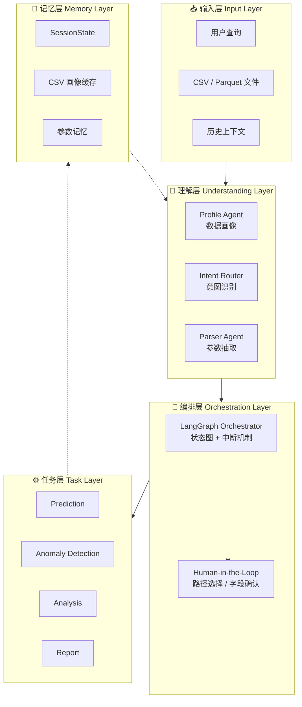
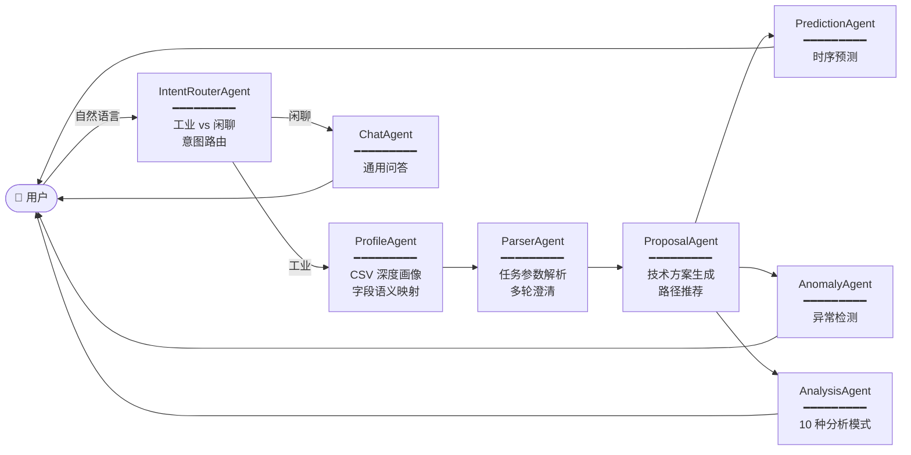

<div align="center">

# Industrial Time Series Agent

### 工业时间序列多智能体分析系统

*Driven by Language. Orchestrated by Graphs. Validated by Data.*

[](https://www.python.org/)
[](https://fastapi.tiangolo.com/)
[](https://react.dev/)
[](https://www.typescriptlang.org/)
[](https://langchain-ai.github.io/langgraph/)
[](https://vitejs.dev/)
[](https://tailwindcss.com/)
[](LICENSE)
[](https://github.com/your-repo/pulls)

</div>

---

> **一句话简介：** 一个面向工业时序数据的对话式多智能体系统。它先用大模型理解你的数据与意图，再通过 LangGraph 编排预测、异常检测、统计分析等专业智能体，最终以可交互的图表与结论回馈用户 —— 全程自然语言驱动，关键节点支持人工介入。

<br>

## 目录

- [产品预览](#产品预览)
- [核心特性](#核心特性)
- [系统架构](#系统架构)
- [多智能体协作](#多智能体协作)
- [技术栈](#技术栈)
- [项目结构](#项目结构)
- [快速开始](#快速开始)
- [配置说明](#配置说明)
- [API 速览](#api-速览)
- [典型场景](#典型场景)
- [工程亮点](#工程亮点)
- [路线图](#路线图)
- [许可证](#许可证)

<br>

## 产品预览

### 登录页面
统一身份认证入口，支持注册 / 登录与会话保活，保证数据与模型的多租户隔离。

<p align="center">
  
</p>

### 主页面
左侧为会话与数据资产导航，中央为对话式工作区，支持流式响应、嵌入式图表卡片与人机交互面板。

<p align="center">
  
</p>

<br>

## 核心特性

<div align="center">

| 能力 | 描述 |
| :--- | :--- |
| 🧠 **多智能体编排** | 8 个专业 Agent 在 LangGraph 状态图上分工协作，由统一的 Orchestrator 调度 |
| 💬 **自然语言交互** | 上传 CSV → 用一句话提问 → 获得图表 + 结论 + 解释 |
| 🔁 **Human-in-the-Loop** | 关键路径支持中断、确认、回退，用户始终掌控决策权 |
| 📈 **专业时序分析** | 预测、异常检测、季节性分解、变点检测、相关性分析等 10+ 模式 |
| 🗂️ **数据画像优先** | LLM 先"看懂"你的数据，再决定调用哪个工具，避免盲调 |
| 🧩 **结构化输出** | 所有 Agent 通信由 Pydantic Schema 约束，告别"自由文本解析失败" |
| 🔐 **多租户隔离** | 用户、数据集、模型三层隔离，会话状态可持久化 |
| ⚡ **流式响应** | NDJSON 流式传输，结果边算边出，体验顺滑 |

</div>

<br>

## 系统架构

系统采用经典的 **五层架构**，每一层职责清晰、可独立演进：



<br>

## 多智能体协作

八大专业智能体各司其职，由 Orchestrator 在 LangGraph 中动态调度：



### 各智能体能力一览

<details>
<summary><b>IntentRouterAgent · 意图路由</b></summary>

- 区分"工业时序分析任务"与"通用闲聊"
- 输出结构化路由决策，避免无效工具调用
</details>

<details>
<summary><b>ProfileAgent · 数据画像</b></summary>

- 自动扫描 CSV：行数、列类型、缺失率、时间范围
- 字段语义识别（时间列 / 数值列 / 类别列）
- `ColumnMapping`：业务语义名 ↔ CSV 列名，三态映射 `mapped / uncertain / unmapped`
- 输出后续 Agent 共享的"数据画像快照"
</details>

<details>
<summary><b>ParserAgent · 参数解析</b></summary>

- 从自然语言中抽取预测步长、检测方法、目标字段等参数
- 信息不足时触发多轮澄清对话
- 复用历史参数，避免重复询问
</details>

<details>
<summary><b>ProposalAgent · 技术方案</b></summary>

- 为复杂任务生成多条候选技术路径
- 触发 Human-in-the-Loop：用户选择最优路径
- 输出可执行的工具调用计划
</details>

<details>
<summary><b>PredictionAgent · 时序预测</b></summary>

- 多种预测算法可选
- 置信区间输出
- 回测评估与多模型对比
</details>

<details>
<summary><b>AnomalyAgent · 异常检测</b></summary>

- 5 种工作模式：自动 / 手动 / 训练保存 / 加载预测 / 评估对比
- 集成 PyOD 异常检测算法库
- 输出异常评分散点图
</details>

<details>
<summary><b>AnalysisAgent · 通用分析（10 种模式）</b></summary>

| # | 模式 | # | 模式 |
| :-: | :--- | :-: | :--- |
| 1 | 趋势分析 | 6 | 离群点检测 |
| 2 | 相关性分析 | 7 | 季节性分解 |
| 3 | 对比分析 | 8 | 变点检测 |
| 4 | 分布分析 | 9 | 稳定性分析 |
| 5 | 数据质量检查 | 10 | 分组聚合 |

</details>

<details>
<summary><b>ChatAgent · 通用问答</b></summary>

- 处理寒暄、概念解释、能力咨询
- 保持对话的自然与连贯
</details>

<br>

## 技术栈

<div align="center">

### 🧩 后端 · Backend


### 🎨 前端 · Frontend


### 🤖 模型 · LLM


</div>

<br>

## 项目结构

```
Industrial_Time_Series_Agent/
├── agent_app/                          # 🔵 后端 · 多智能体核心
│   ├── agents/                         #   智能体模块
│   │   ├── orchestrator_graph.py       #     LangGraph 编排器
│   │   ├── intent_router_agent.py      #     意图路由
│   │   ├── profile_agent.py            #     CSV 画像
│   │   ├── parser_agent.py             #     参数解析
│   │   ├── proposal_agent.py           #     技术方案
│   │   ├── prediction_agent.py         #     预测智能体
│   │   ├── anomaly_detection_agent.py  #     异常检测
│   │   ├── analysis_agent.py           #     通用分析
│   │   └── chat_agent.py               #     闲聊处理
│   ├── tools/                          #   工具函数库
│   │   ├── analysis_tools/             #     10 种分析工具
│   │   ├── prediction_tools/           #     预测工具
│   │   ├── anomaly_detection_tools/    #     异常检测工具
│   │   └── profile_tools/              #     数据画像工具
│   ├── charts/                         #   图表生成模块
│   ├── models/                         #   Pydantic 数据模型
│   ├── state/                          #   会话状态管理
│   ├── prompts/                        #   智能体提示词
│   ├── auth/                           #   用户认证系统
│   ├── config/                         #   配置管理
│   ├── requirements.txt                #   Python 依赖
│   └── .env.example                    #   环境变量模板
│
├── frontend/                           # 🟢 前端 · React 应用
│   ├── src/
│   │   ├── components/                 #   React 组件
│   │   │   ├── auth/                   #     登录 / 注册
│   │   │   ├── chat/                   #     聊天界面
│   │   │   ├── interrupt/              #     人机交互面板
│   │   │   ├── analysis_chart/         #     分析图表
│   │   │   ├── forecast_chart/         #     预测图表
│   │   │   └── anomaly_chart/          #     异常图表
│   │   ├── context/                    #   React Context
│   │   ├── services/                   #   API 调用
│   │   └── types/                      #   TypeScript 类型
│   ├── package.json
│   └── .env.example
│
├── 登录页面.png                          # 📷 产品截图
├── 主页面.png                            # 📷 产品截图
└── README.md
```

<br>

## 快速开始

### 前置要求

- **Python** ≥ 3.10
- **Node.js** ≥ 18（推荐 20+）
- **npm** 或 **pnpm** / **yarn**
- 任一 LLM API Key（OpenAI 或 Anthropic）

### 1️⃣ 克隆仓库

```bash
git clone https://github.com/<your-username>/Industrial_Time_Series_Agent.git
cd Industrial_Time_Series_Agent
```

### 2️⃣ 启动后端

```bash
cd agent_app

# 创建并激活虚拟环境
python -m venv venv
# Windows
venv\Scripts\activate
# macOS / Linux
source venv/bin/activate

# 安装依赖
pip install -r requirements.txt

# 配置环境变量
cp .env.example .env
# 编辑 .env，填入你的 LLM_API_KEY 等配置

# 启动 API 服务（默认监听 8000 端口）
uvicorn main:app --host 0.0.0.0 --port 8000 --reload
```

> 💡 Windows 用户也可直接双击运行 `start.bat`，按菜单交互式启动。

### 3️⃣ 启动前端

```bash
cd frontend

# 安装依赖
npm install

# 配置环境变量（开发模式下可留空，自动走 Vite 代理）
cp .env.example .env.local

# 启动开发服务器
npm run dev
```

浏览器打开终端提示的本地地址（通常为 `http://localhost:5173`），注册账号并登录后即可开始使用。

### 4️⃣ 生产构建

```bash
cd frontend
npm run build       # 输出至 frontend/dist
npm run preview     # 本地预览生产构建
```

<br>

## 配置说明

### 后端环境变量（`agent_app/.env`）

| 变量 | 说明 | 默认值 |
| :--- | :--- | :--- |
| `LLM_PROVIDER` | LLM 提供方（`openai` / `anthropic`） | `openai` |
| `LLM_MODEL_NAME` | 模型名称 | `gpt-4` |
| `LLM_API_KEY` | **必填** · LLM API Key | — |
| `LLM_TEMPERATURE` | 采样温度 | `0.7` |
| `DB_BACKEND` | 状态持久化后端（`sqlite` / `postgresql` / `redis`） | `sqlite` |
| `DB_CONNECTION_STRING` | 数据库连接串 | `sqlite:///sessions.db` |
| `MAX_CONVERSATION_HISTORY` | 对话历史最大轮数 | `50` |
| `SESSION_TIMEOUT_MINUTES` | 会话超时（分钟） | `30` |
| `DEFAULT_PREDICTION_STEPS` | 默认预测步长 | `25` |
| `MAX_FILE_SIZE_MB` | 上传文件大小上限（MB） | `100` |
| `API_HOST` / `API_PORT` | 服务监听地址 / 端口 | `0.0.0.0` / `8000` |

完整变量见 [`agent_app/.env.example`](agent_app/.env.example)。

### 前端环境变量（`frontend/.env.local`）

| 变量 | 说明 |
| :--- | :--- |
| `VITE_API_BASE_URL` | 后端基址。开发留空走 Vite 代理；生产填后端绝对地址 |

<br>

## API 速览

后端基于 FastAPI，所有响应均为 JSON；主查询接口采用 **NDJSON 流式传输**，逐行推送 Agent 的中间产物。

| 方法 | 路径 | 说明 |
| :--- | :--- | :--- |
| `POST` | `/api/query` | 主查询接口（流式） |
| `GET` | `/api/session/{id}` | 获取会话信息 |
| `DELETE` | `/api/session/{id}/reset` | 重置当前任务 |
| `GET` | `/api/sessions` | 会话列表 |
| `GET` | `/api/sessions/{id}/messages` | 会话消息历史 |
| `DELETE` | `/api/sessions/{id}` | 删除会话 |
| `GET` | `/api/datasets` | 当前用户数据集列表 |
| `GET` | `/api/models` | 当前用户已训练模型 |
| `POST` | `/api/auth/register` | 用户注册 |
| `POST` | `/api/auth/login` | 用户登录 |
| `GET` | `/api/auth/me` | 会话校验 |

### 一次完整的对话调用示例

```bash
# 流式发起一次分析请求
curl -N -X POST http://localhost:8000/api/query \
  -H "Content-Type: application/json" \
  -H "Authorization: Bearer <your-token>" \
  -d '{
    "session_id": "<session-id>",
    "query": "帮我对 temperature 列做未来 30 步的预测，并标记异常点"
  }'
```

> 返回为 NDJSON 流，每行一个 JSON 事件，包含 Agent 状态迁移、工具调用、图表数据与最终结论。

<br>

## 典型场景

<div align="center">

| 🏭 场景 | 💡 价值 |
| :--- | :--- |
| **传感器数据监控** | 上传 IoT 时序，一句话完成趋势 + 异常联合分析 |
| **设备故障预测** | 预测关键指标未来走势，提前识别风险窗口 |
| **生产质量分析** | 多变量相关性分析，定位质量波动的根因变量 |
| **业务指标预测** | 季节性分解 + 预测，辅助运营决策 |
| **异常根因分析** | 异常检测 + 变点检测，自动输出可疑时段 |

</div>

<br>

## 工程亮点

- **🧱 五层清晰架构** · 输入 / 理解 / 编排 / 任务 / 记忆，分层解耦，便于演进
- **🔒 类型安全** · 端到端 Pydantic + TypeScript，前后端契约严丝合缝
- **🧭 结构化输出优先** · Agent 间通信全部 Schema 化，告别脆弱的字符串解析
- **🪝 Human-in-the-Loop** · 三种中断节点（路径选择 / 文件上传 / 参数澄清），关键决策人在回路
- **🧠 业务语义与数据字段分离** · `ColumnMapping` 三态映射，让 LLM 始终"知道自己在说什么"
- **📦 工具化设计** · 每个分析能力都是独立工具，新增能力只需实现接口并注册
- **📊 状态可观测** · LangGraph + SQLite Checkpoint，会话状态可追溯、可回放
- **🌐 多租户隔离** · 用户 / 数据集 / 模型三层隔离，天然适合团队部署

<br>

## 路线图

- [x] 八智能体协作主流程
- [x] Human-in-the-Loop 中断机制
- [x] 10 种分析模式 + 5 种异常检测模式
- [x] 多租户认证与数据隔离
- [ ] 支持 Streaming CSV / 实时数据源接入
- [ ] 模型管理 UI（模型版本对比、A/B 测试）
- [ ] 报告导出（PDF / Word / Excel）
- [ ] 中文场景下字段语义识别增强
- [ ] Kubernetes 部署 Helm Chart

<br>

## 许可证

本项目采用 [MIT License](LICENSE) 开源协议。

---

<div align="center">

**⭐ 如果这个项目对你有帮助，欢迎 Star 支持**

*Built with care for industrial data intelligence.*

</div>
